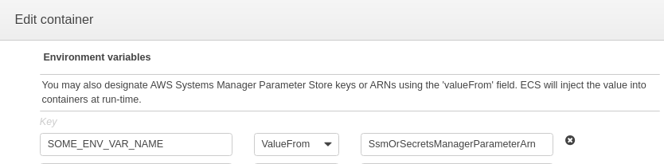

Recently AWS made ECS to [support configuring tasks with parameters stored in AWS Systems Manager Parameter Store or AWS Secrets Manager](https://docs.aws.amazon.com/AmazonECS/latest/developerguide/specifying-sensitive-data.html).

Despite the feature [was introduced in November, 2018](https://aws.amazon.com/about-aws/whats-new/2018/11/aws-launches-secrets-support-for-amazon-elastic-container-servic/),
as of April, 2019 it still lacks support from CloudFormation.

This sample CloudFormation template demonstrates how to leverage CloudFormation Custom Resource backed by AWS Lambda to tackle the issue.

Additional complication arises because in AWS Lambda function implementing CF custom resource
we are going to use AWS SDK to call registerTaskDefinition.
See TaskDefinitionExtCustomResource in [template.yaml](template.yaml). But version of the SDK available on Lambda by default is a little bit outdated, and also has no support for 'Secrets' property.

We bring a better version of SDK with an [AWS Lambda Layer](https://docs.aws.amazon.com/lambda/latest/dg/configuration-layers.html) we configure in the template.

Enjoy!



Hopefully AWS will update CloudFormation to support ValueFrom variables in near future.

# How to deploy the example
```
cd aws-js-sdk && npm install
aws cloudformation package --s3-bucket ... --template-file template.yaml --output-template-file template-out.yaml
aws cloudformation deploy --stack-name ... --template-file template-out.yaml --capabilities CAPABILITY_IAM
```